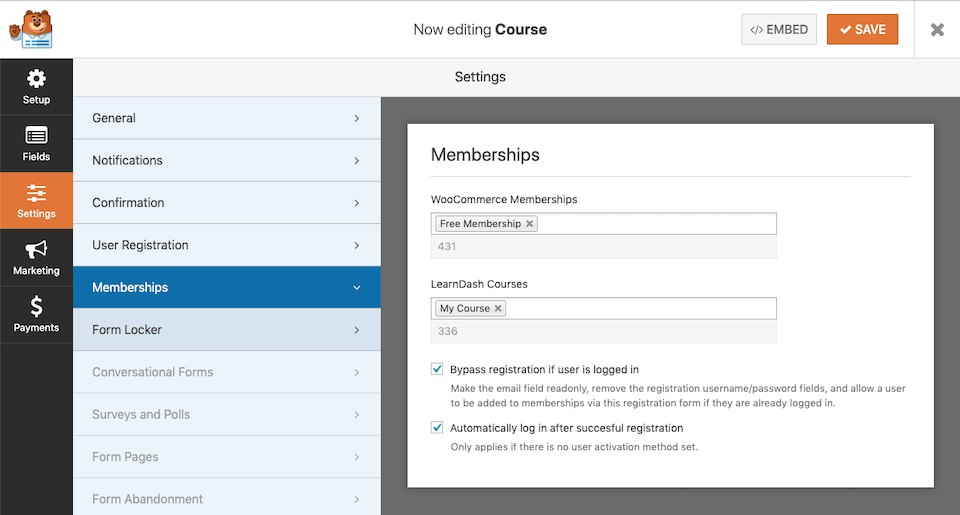

# WP Forms Memberships
Add users to WooCommerce Memberships with WPForms.

## Core Functionality
* Add a user to one or more memberships upon successful form submission.
* Use a registration form to register a user before adding them to a membership.
* Bypass user registration if the user is already logged in. This allows you to use one form (User Registration) for membership access when you may have existing (logged in) users that want to join a membership.
* Automatically log in a user after successful registration.
* Adds a login link to the error message of a User Registration form if an existing username/email is used. Link will auto-redirect the user back to the URL with the original form.

## How To Use

### User Registration Form
1. Create a User Registration form (requires WP Forms full version).
1. Add one or more WooCommerce Membership Plans in the form settings.
1. Optionally allow bypassing the registration process in WP Forms for logged in users that may try to fill out the form.
1. Optionally allow auto login of the user after successful user registration.
1. Configure the form and settings accordingly, to successfully create a user.
1. Configure notifications/redirect as needed, typically configured based on whether user approval is required. If user approval is not required it may be nice to redirect the user right to the content.

### All Forms (requires user to be logged in)
1. Create any type of form besides a User Registration form.
1. Add one or more WooCommerce Membership Plans in the form settings.
1. You don't need to add fields to the form since the logged in user will be added to the membership plan.
1. If you only want a button, add a Hidden Field and set the default value to the current Post/Page URL.
1. Configure notifications and form redirect as needed.
